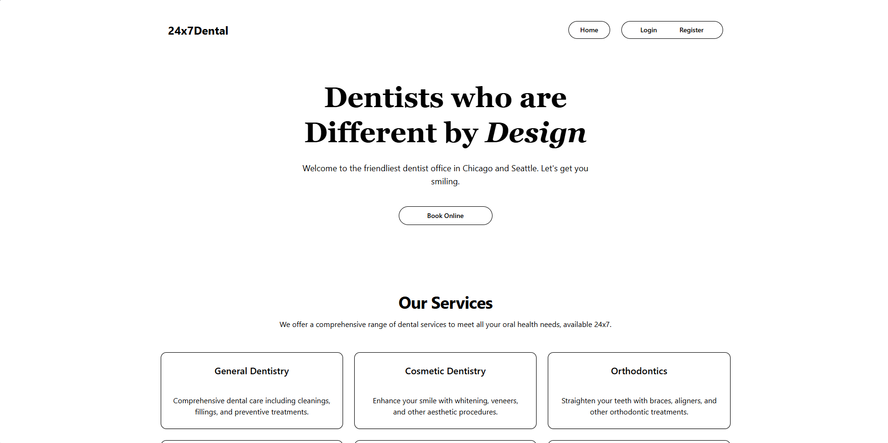

# Dental 24x7 - Online Appointment Scheduling System

Dental 24x7 is a web application that allows patients to book and manage their dental appointments online. The system provides a seamless experience for users to schedule appointments, manage their bookings, and interact with the dental office.

**[Technical Walkthrough Video](https://drive.google.com/file/d/1VXo5dBTQrZb8kUtDNw-bhTteL9FuFsg_/view?usp=sharing)**

## Table of Contents

- [Features]()
- [Tech Stack]()
- [Installation]()
- [Usage]()
- [Screenshots]()
- [Backend Integration]()

## Features

- **Patient Booking:** Users can select a dentist, view available time slots, and book an appointment.
- **User Authentication:** Secure login and registration system for patients.
- **User Dashboard:** Patients can view, reschedule, or cancel their appointments.
- **Admin Dashboard (Future Scope):** Manage dentists, appointments, and user profiles.

## Tech Stack

**Frontend:**

- React (Vite for fast builds)
- Tailwind CSS (Styling)
- React Router (Navigation)
- Axios (API calls)
- React Toastify (Notifications)

## Installation

To run the frontend locally, follow these steps:

1. **Clone the repository:**
   ```bash
   git clone https://github.com/SadPenguin24/dental24x7_frontend.git
   ```
2. **Navigate to the project directory:**
   ```bash
   cd dental24x7_frontend
   ```
3. **Install dependencies:**
   ```bash
   npm install
   ```
4. **Create a `.env.local` file in the project root and configure your backend URL:**
   ```env
   VITE_BACKEND_URL='http://localhost:5000'
   ```
5. **Run the development server:**
   ```bash
   npm run dev
   ```
6. The application should now be running on `http://localhost:5173/`.

## Usage

1. **Patient Registration & Login:**
   - New users can sign up and log in securely.
2. **Book an Appointment:**
   - Select a preferred dentist and available time slot.
3. **Manage Appointments:**
   - View upcoming appointments.
   - Reschedule or cancel an appointment if necessary.

## Screenshots




## Backend Integration

The backend for this project is being developed separately. For API integration, refer to the backend repository:

**[Backend Repo](https://github.com/SadPenguin24/dental24x7_backend)**

**[Live Demo](https://dental24x7-frontend.onrender.com)**
